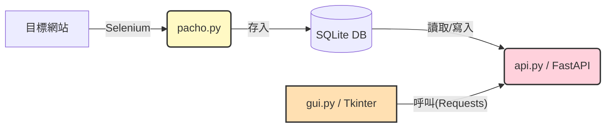
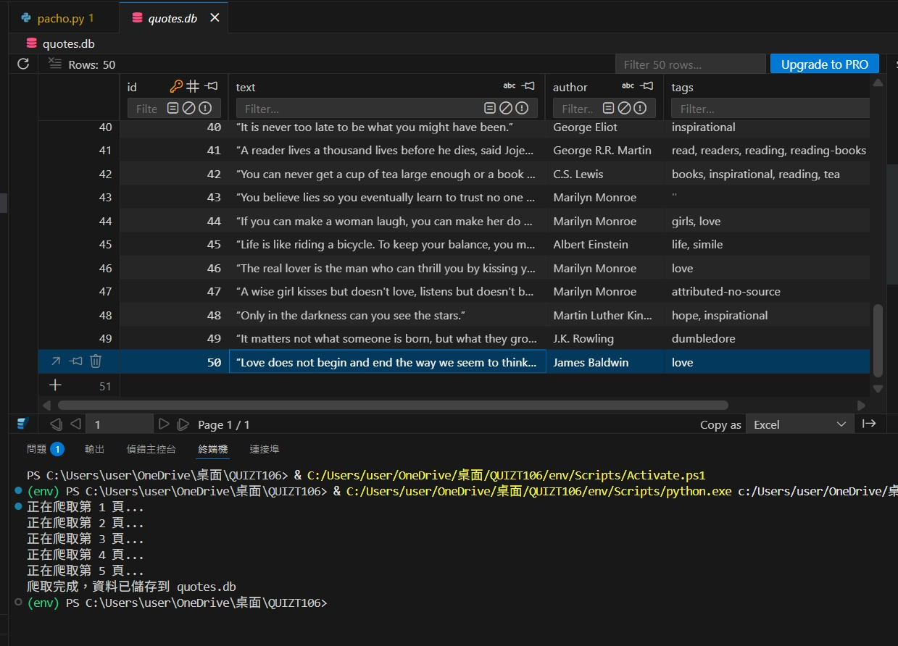
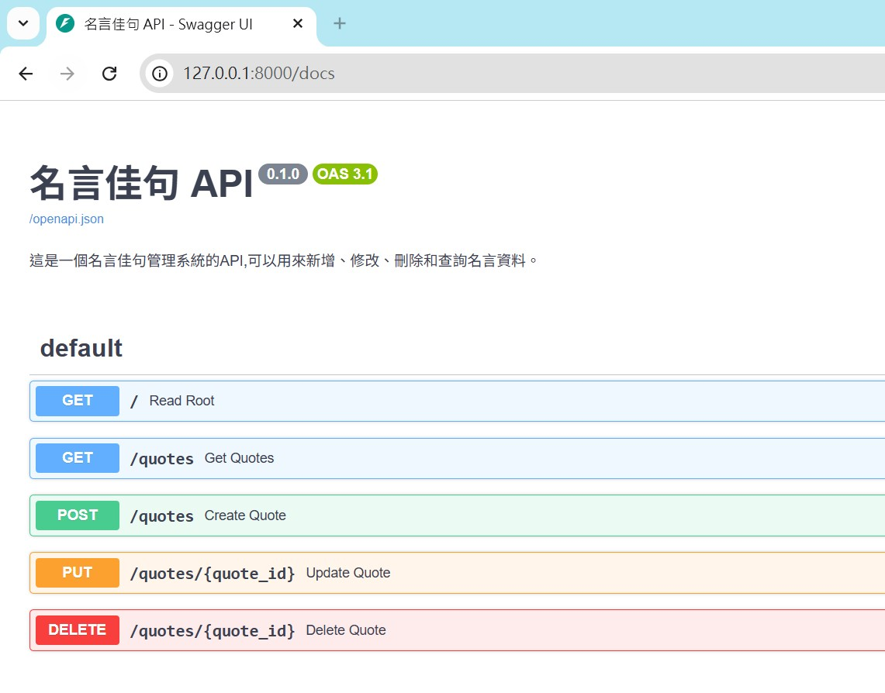
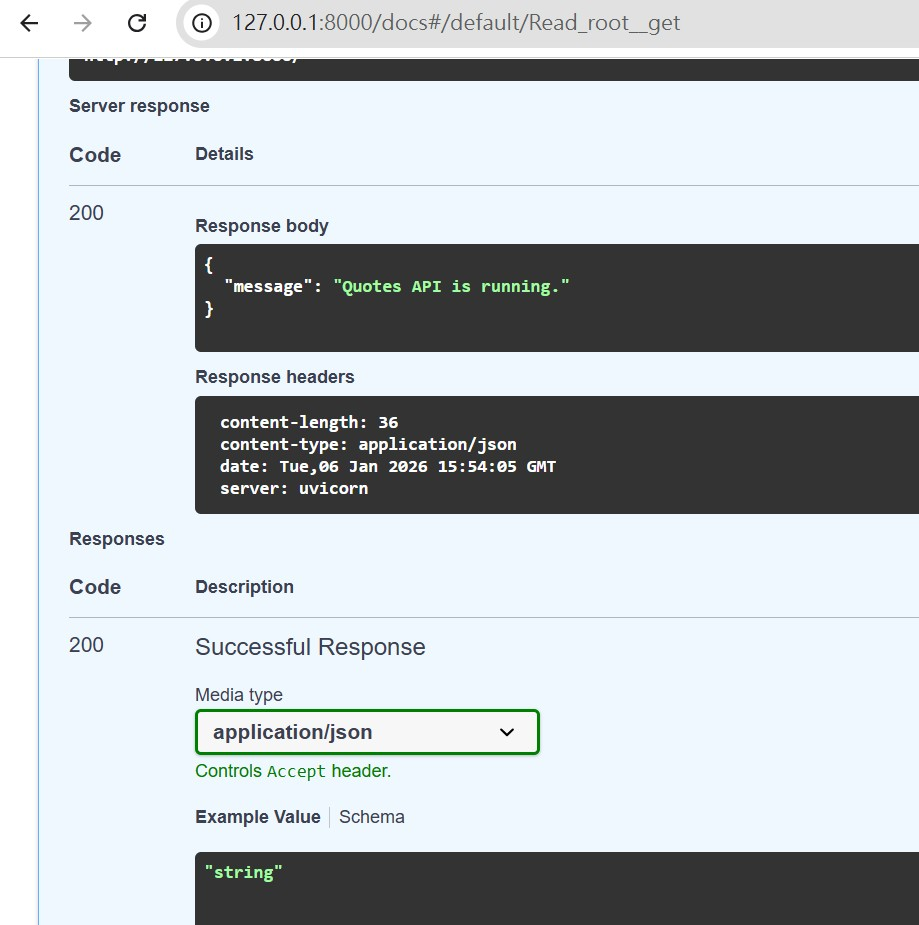
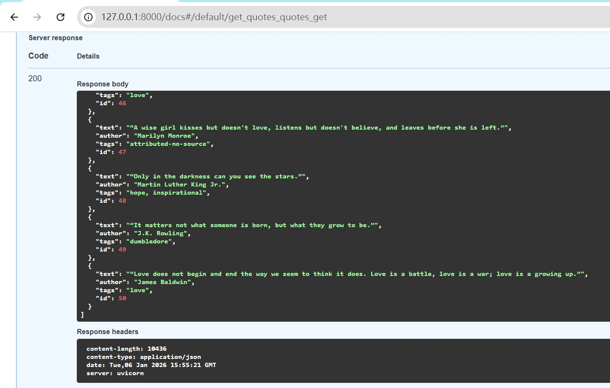
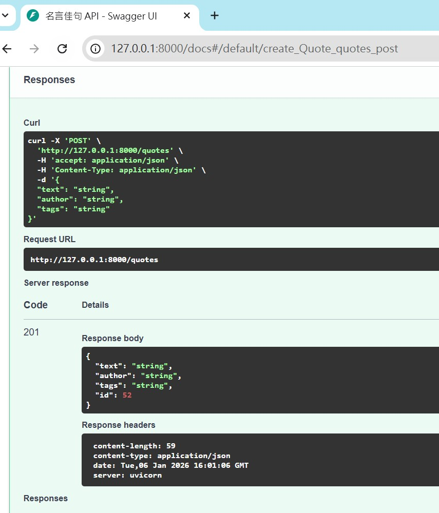
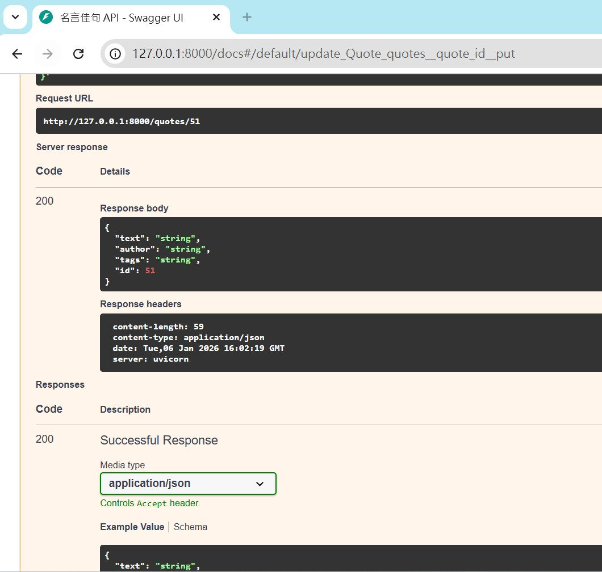
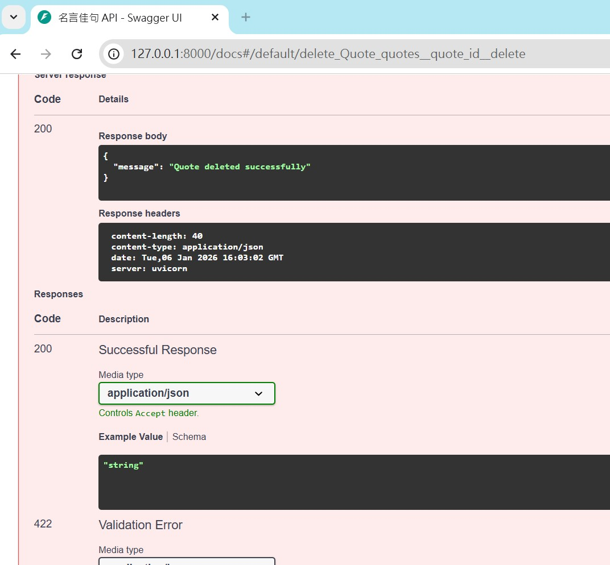
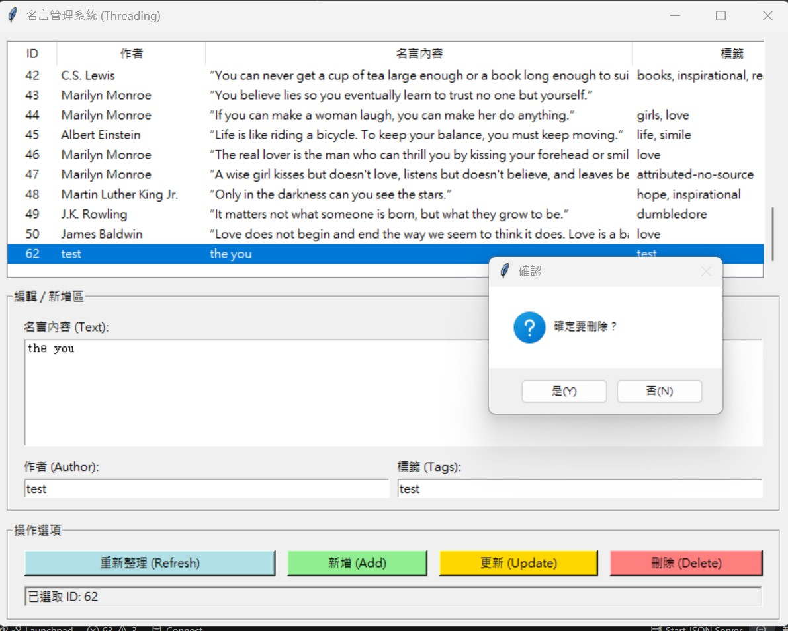
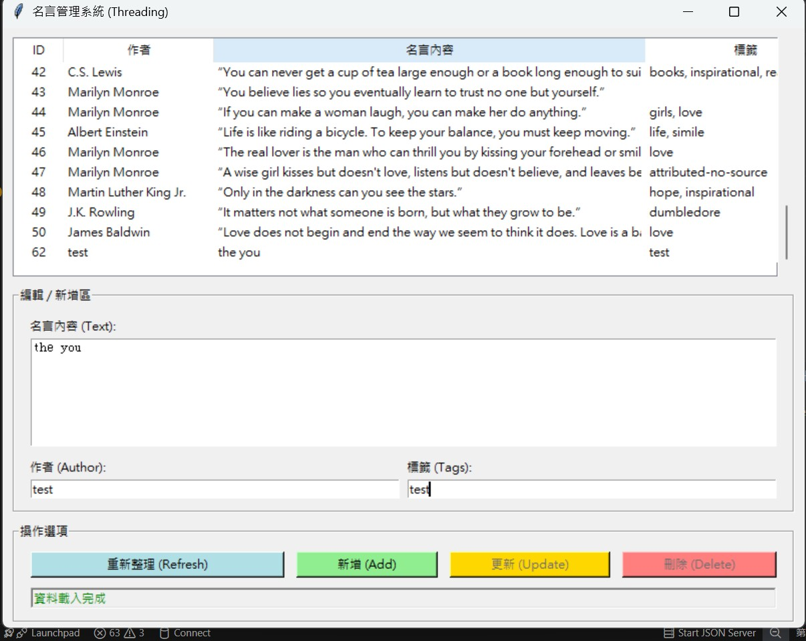

# [全端整合專案：動態名言佳句管理系統]()

```
此專案採用 Selenium 爬蟲、FastAPI 後端以及 Tkinter GUI 前端開發。
```


### 專案架構圖 (Project Architecture)

```
抓取一個使用 JavaScript 動態渲染的「名人名言資料庫」，網站資料：Quotes to 
Scrape (JavaScript 版本)，並將其存入資料庫，再設計 API 存取資料，最後製
作一個不會卡頓的視窗程式來進行這些資料的 CRUD。
```



### [第一部分：動態爬蟲](pacho.py)
```
目標： 從「名人名言資料庫」網站：http://quotes.toscrape.com/js/ 爬取資料
```
[成果 : ]() 



### [第二部分：API 後端](api.py)
```
目標： 使用 FastAPI 建立 RESTful API，讓外部程式可以操作資料庫。
```
[成果 : ]() 
```
1. 啟動 API：uvicorn api:app --reload
```

```
2. Swagger UI：http://127.0.0.1:8000/docs → 互動測試
```

```
3.  GET 端點測試
```

```
4. 取得全部文章
(1) 展開 GET /posts
(2) 點選 Try it out**
(點選之前可視為是 API 的端點使用說明，點選之後變成可以進行 API 測試)
```

```
5. POST  端點測試
```

```
6. put  端點測試
```

```
7.  DELETE 端點測試
```

```
8.  GUI 執行時，API 必須保持開啟狀態
```

### [第三部分：視窗管理程式](gui.py)
```
目標： 使用 Tkinter 設計一個 GUI，透過 呼叫 API 來進行 CRUD 操作。


關鍵要求：必須實作多執行緒 (Threading) 機制，確保在進行 API 請求時，
視窗畫面不會凍結（卡死）。
```
[成果 : ]() 
```
1. python gui.py (  測試新增、刪除、修改功能是否同步影響 API 與資料庫
，且操作時畫面流暢  )
```

```
2.狀態列 (Status Bar)
```



  

### project
```
final-exam-project/
├── pacho.py         # 爬蟲程式 (Selenium)
├── api.py           # 後端 API (FastAPI)
├── gui.py           # 前端介面 (Tkinter)
├── quotes.db        # 資料庫 (由程式 pacho.py 產生)
├── requirements.txt # 套件依賴清單
├── README.md        # 專案說明與操作截圖
├── .gitignore       # 忽略 .db 與 __pycache__
└── LICENSE
```